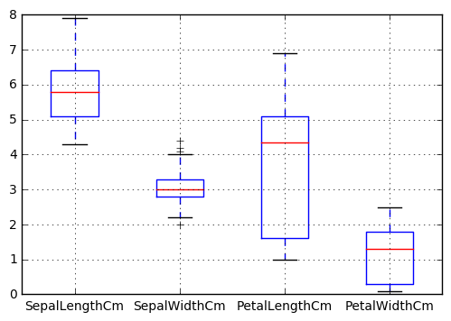
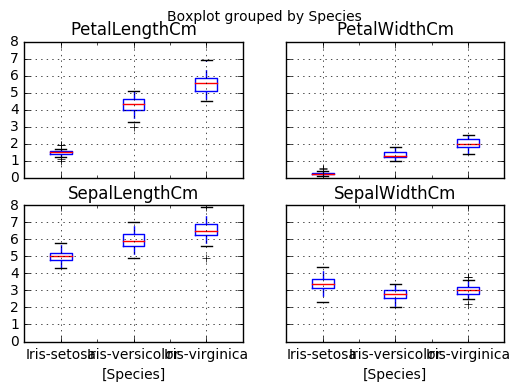
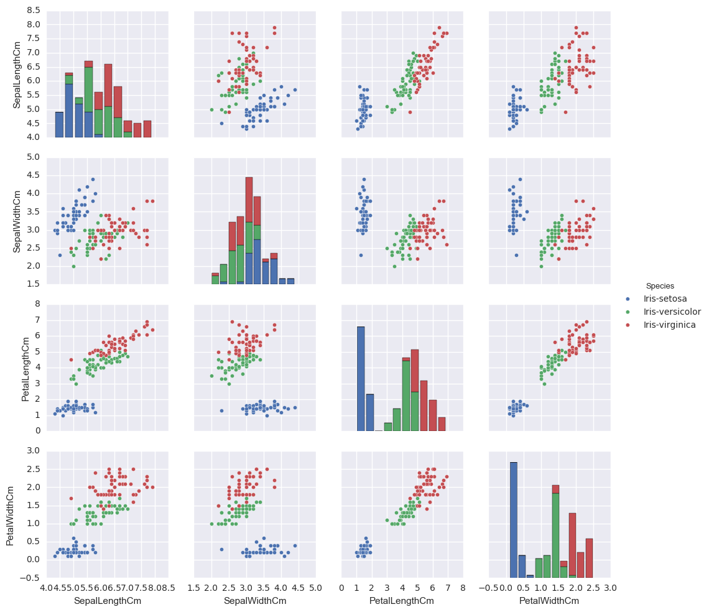

```python
from IPython.display import Image
from IPython.core.display import HTML 
```

Create a list named my_list in python with the following data points -
45.4 44.2 36.8 35.1 39.0 60.0 47.4 41.1 45.8 35.6


```python
my_list=[45.4 ,44.2 ,36.8, 35.1, 39.0, 60.0, 47.4, 41.1, 45.8, 35.6]
```


```python
my_list
```


    [45.4, 44.2, 36.8, 35.1, 39.0, 60.0, 47.4, 41.1, 45.8, 35.6]


a. Print the 5th element in the list


```python
my_list[5]
```


    60.0


b. Append 55.2 to my_list


```python
my_list.append(55.2)
```

c. Remove the 6th element in the list


```python
del my_list[6]
```


```python
my_list
```


    [45.4, 44.2, 36.8, 35.1, 39.0, 60.0, 41.1, 45.8, 35.6, 55.2]


d. Iterate over the list to print data points greater than 45


```python
for obs in my_list:
    if(obs>45):
        print(obs)
    
```

    45.4
    60.0
    45.8
    55.2
    

a. Import the numpy library using the following command – import numpy


```python
import numpy
```

b. Declare numpy array with the same data points as in my_list using numpy.array()


```python
numpyArray=numpy.array(my_list)
```


```python
numpyArray
```


    array([ 45.4,  44.2,  36.8,  35.1,  39. ,  60. ,  41.1,  45.8,  35.6,  55.2])


c. Compute the mean and standard deviation using numpy.mean() and numpy.std() of
the above array


```python
numpy.mean(numpyArray)
```


    43.82


```python
numpy.std(numpyArray)
```


    7.8827406401580919


d. Use logical referencing to get only those values that are less than 45


```python
numpyArray[numpyArray<45]
```


    array([ 44.2,  36.8,  35.1,  39. ,  41.1,  35.6])


e. Compute the max and min of the array using numpy.max() and numpy.min()
3.


```python
numpy.max(numpyArray)
```


    60.0


```python
numpy.min(numpyArray)
```


    35.100000000000001


a. Import the pandas library – import pandas


```python
import pandas as pd
```

b. Read the IRIS dataset into iris using pandas.read_csv(). Data file –


```python
iris=pd.read_csv('C:/Homework/R/Unit13/Iris.csv')
```

c. Using iris.head(), display the head of the dataset


```python
iris.head()
```


<div>
<table border="1" class="dataframe">
  <thead>
    <tr style="text-align: right;">
      <th></th>
      <th>Id</th>
      <th>SepalLengthCm</th>
      <th>SepalWidthCm</th>
      <th>PetalLengthCm</th>
      <th>PetalWidthCm</th>
      <th>Species</th>
    </tr>
  </thead>
  <tbody>
    <tr>
      <th>0</th>
      <td>1</td>
      <td>5.1</td>
      <td>3.5</td>
      <td>1.4</td>
      <td>0.2</td>
      <td>Iris-setosa</td>
    </tr>
    <tr>
      <th>1</th>
      <td>2</td>
      <td>4.9</td>
      <td>3.0</td>
      <td>1.4</td>
      <td>0.2</td>
      <td>Iris-setosa</td>
    </tr>
    <tr>
      <th>2</th>
      <td>3</td>
      <td>4.7</td>
      <td>3.2</td>
      <td>1.3</td>
      <td>0.2</td>
      <td>Iris-setosa</td>
    </tr>
    <tr>
      <th>3</th>
      <td>4</td>
      <td>4.6</td>
      <td>3.1</td>
      <td>1.5</td>
      <td>0.2</td>
      <td>Iris-setosa</td>
    </tr>
    <tr>
      <th>4</th>
      <td>5</td>
      <td>5.0</td>
      <td>3.6</td>
      <td>1.4</td>
      <td>0.2</td>
      <td>Iris-setosa</td>
    </tr>
  </tbody>
</table>
</div>


d. Use DataFrame.drop() to drop the id column


```python
dropID=iris.drop('Id',1)
```


```python
dropID.head()
```


<div>
<table border="1" class="dataframe">
  <thead>
    <tr style="text-align: right;">
      <th></th>
      <th>SepalLengthCm</th>
      <th>SepalWidthCm</th>
      <th>PetalLengthCm</th>
      <th>PetalWidthCm</th>
      <th>Species</th>
    </tr>
  </thead>
  <tbody>
    <tr>
      <th>0</th>
      <td>5.1</td>
      <td>3.5</td>
      <td>1.4</td>
      <td>0.2</td>
      <td>Iris-setosa</td>
    </tr>
    <tr>
      <th>1</th>
      <td>4.9</td>
      <td>3.0</td>
      <td>1.4</td>
      <td>0.2</td>
      <td>Iris-setosa</td>
    </tr>
    <tr>
      <th>2</th>
      <td>4.7</td>
      <td>3.2</td>
      <td>1.3</td>
      <td>0.2</td>
      <td>Iris-setosa</td>
    </tr>
    <tr>
      <th>3</th>
      <td>4.6</td>
      <td>3.1</td>
      <td>1.5</td>
      <td>0.2</td>
      <td>Iris-setosa</td>
    </tr>
    <tr>
      <th>4</th>
      <td>5.0</td>
      <td>3.6</td>
      <td>1.4</td>
      <td>0.2</td>
      <td>Iris-setosa</td>
    </tr>
  </tbody>
</table>
</div>


e. Subset dataframe to create a new data frame that includes only the measurements for
the setosa species


```python
setosa=pd.DataFrame(iris[iris.Species=='Iris-setosa'])
```

f. Use DataFrame.describe() to get the summary statistics


```python
setosa.describe()
```


<div>
<table border="1" class="dataframe">
  <thead>
    <tr style="text-align: right;">
      <th></th>
      <th>Id</th>
      <th>SepalLengthCm</th>
      <th>SepalWidthCm</th>
      <th>PetalLengthCm</th>
      <th>PetalWidthCm</th>
    </tr>
  </thead>
  <tbody>
    <tr>
      <th>count</th>
      <td>50.00000</td>
      <td>50.00000</td>
      <td>50.000000</td>
      <td>50.000000</td>
      <td>50.00000</td>
    </tr>
    <tr>
      <th>mean</th>
      <td>25.50000</td>
      <td>5.00600</td>
      <td>3.418000</td>
      <td>1.464000</td>
      <td>0.24400</td>
    </tr>
    <tr>
      <th>std</th>
      <td>14.57738</td>
      <td>0.35249</td>
      <td>0.381024</td>
      <td>0.173511</td>
      <td>0.10721</td>
    </tr>
    <tr>
      <th>min</th>
      <td>1.00000</td>
      <td>4.30000</td>
      <td>2.300000</td>
      <td>1.000000</td>
      <td>0.10000</td>
    </tr>
    <tr>
      <th>25%</th>
      <td>13.25000</td>
      <td>4.80000</td>
      <td>3.125000</td>
      <td>1.400000</td>
      <td>0.20000</td>
    </tr>
    <tr>
      <th>50%</th>
      <td>25.50000</td>
      <td>5.00000</td>
      <td>3.400000</td>
      <td>1.500000</td>
      <td>0.20000</td>
    </tr>
    <tr>
      <th>75%</th>
      <td>37.75000</td>
      <td>5.20000</td>
      <td>3.675000</td>
      <td>1.575000</td>
      <td>0.30000</td>
    </tr>
    <tr>
      <th>max</th>
      <td>50.00000</td>
      <td>5.80000</td>
      <td>4.400000</td>
      <td>1.900000</td>
      <td>0.60000</td>
    </tr>
  </tbody>
</table>
</div>


g. Use DataFrame.plot() to plot the boxplot for all 4 numeric columns/iris measurements


```python
import matplotlib.pyplot as plt
dropID.boxplot()
plt.show()
```

    C:\Users\robcline\Anaconda3\lib\site-packages\ipykernel\__main__.py:2: FutureWarning: 
    The default value for 'return_type' will change to 'axes' in a future release.
     To use the future behavior now, set return_type='axes'.
     To keep the previous behavior and silence this warning, set return_type='dict'.
      from ipykernel import kernelapp as app
    





h. Use DataFrame.groupby() to create grouped data frames by Species and compute
summary statistics using DataFrame.describe()


```python
dropID.groupby( [ "Species"] ).describe()
```


<div>
<table border="1" class="dataframe">
  <thead>
    <tr style="text-align: right;">
      <th></th>
      <th></th>
      <th>PetalLengthCm</th>
      <th>PetalWidthCm</th>
      <th>SepalLengthCm</th>
      <th>SepalWidthCm</th>
    </tr>
    <tr>
      <th>Species</th>
      <th></th>
      <th></th>
      <th></th>
      <th></th>
      <th></th>
    </tr>
  </thead>
  <tbody>
    <tr>
      <th rowspan="8" valign="top">Iris-setosa</th>
      <th>count</th>
      <td>50.000000</td>
      <td>50.000000</td>
      <td>50.000000</td>
      <td>50.000000</td>
    </tr>
    <tr>
      <th>mean</th>
      <td>1.464000</td>
      <td>0.244000</td>
      <td>5.006000</td>
      <td>3.418000</td>
    </tr>
    <tr>
      <th>std</th>
      <td>0.173511</td>
      <td>0.107210</td>
      <td>0.352490</td>
      <td>0.381024</td>
    </tr>
    <tr>
      <th>min</th>
      <td>1.000000</td>
      <td>0.100000</td>
      <td>4.300000</td>
      <td>2.300000</td>
    </tr>
    <tr>
      <th>25%</th>
      <td>1.400000</td>
      <td>0.200000</td>
      <td>4.800000</td>
      <td>3.125000</td>
    </tr>
    <tr>
      <th>50%</th>
      <td>1.500000</td>
      <td>0.200000</td>
      <td>5.000000</td>
      <td>3.400000</td>
    </tr>
    <tr>
      <th>75%</th>
      <td>1.575000</td>
      <td>0.300000</td>
      <td>5.200000</td>
      <td>3.675000</td>
    </tr>
    <tr>
      <th>max</th>
      <td>1.900000</td>
      <td>0.600000</td>
      <td>5.800000</td>
      <td>4.400000</td>
    </tr>
    <tr>
      <th rowspan="8" valign="top">Iris-versicolor</th>
      <th>count</th>
      <td>50.000000</td>
      <td>50.000000</td>
      <td>50.000000</td>
      <td>50.000000</td>
    </tr>
    <tr>
      <th>mean</th>
      <td>4.260000</td>
      <td>1.326000</td>
      <td>5.936000</td>
      <td>2.770000</td>
    </tr>
    <tr>
      <th>std</th>
      <td>0.469911</td>
      <td>0.197753</td>
      <td>0.516171</td>
      <td>0.313798</td>
    </tr>
    <tr>
      <th>min</th>
      <td>3.000000</td>
      <td>1.000000</td>
      <td>4.900000</td>
      <td>2.000000</td>
    </tr>
    <tr>
      <th>25%</th>
      <td>4.000000</td>
      <td>1.200000</td>
      <td>5.600000</td>
      <td>2.525000</td>
    </tr>
    <tr>
      <th>50%</th>
      <td>4.350000</td>
      <td>1.300000</td>
      <td>5.900000</td>
      <td>2.800000</td>
    </tr>
    <tr>
      <th>75%</th>
      <td>4.600000</td>
      <td>1.500000</td>
      <td>6.300000</td>
      <td>3.000000</td>
    </tr>
    <tr>
      <th>max</th>
      <td>5.100000</td>
      <td>1.800000</td>
      <td>7.000000</td>
      <td>3.400000</td>
    </tr>
    <tr>
      <th rowspan="8" valign="top">Iris-virginica</th>
      <th>count</th>
      <td>50.000000</td>
      <td>50.000000</td>
      <td>50.000000</td>
      <td>50.000000</td>
    </tr>
    <tr>
      <th>mean</th>
      <td>5.552000</td>
      <td>2.026000</td>
      <td>6.588000</td>
      <td>2.974000</td>
    </tr>
    <tr>
      <th>std</th>
      <td>0.551895</td>
      <td>0.274650</td>
      <td>0.635880</td>
      <td>0.322497</td>
    </tr>
    <tr>
      <th>min</th>
      <td>4.500000</td>
      <td>1.400000</td>
      <td>4.900000</td>
      <td>2.200000</td>
    </tr>
    <tr>
      <th>25%</th>
      <td>5.100000</td>
      <td>1.800000</td>
      <td>6.225000</td>
      <td>2.800000</td>
    </tr>
    <tr>
      <th>50%</th>
      <td>5.550000</td>
      <td>2.000000</td>
      <td>6.500000</td>
      <td>3.000000</td>
    </tr>
    <tr>
      <th>75%</th>
      <td>5.875000</td>
      <td>2.300000</td>
      <td>6.900000</td>
      <td>3.175000</td>
    </tr>
    <tr>
      <th>max</th>
      <td>6.900000</td>
      <td>2.500000</td>
      <td>7.900000</td>
      <td>3.800000</td>
    </tr>
  </tbody>
</table>
</div>


i. Use DataFrame.boxplot() to plot boxplots by Species


```python
dropID.boxplot(by="Species")
plt.show()
```





j. Plot a scatter matrix plot using the seaborn library.


```python
import seaborn as sns
sns.pairplot(dropID, hue='Species')
plt.show()
```





```python

```


```python

```
